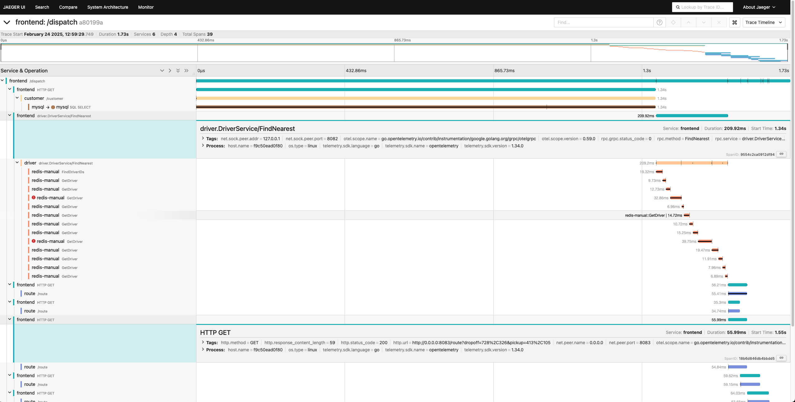

# 분산 트레이싱 도구 jaeger

> 날짜: 2025-02-24

[목록으로](https://shiwoo-park.github.io/blog)

---

## 🕵️‍♂️ Jaeger: 분산 트레이싱(Distributed Tracing) 도구 소개
Jaeger는 CNCF(Cloud Native Computing Foundation) 에서 개발한 오픈소스 분산 트레이싱 시스템으로, 마이크로서비스 환경에서 요청(Trace)의 흐름을 추적하고 성능 문제를 분석하는 데 사용된다.

### 🔹 Jaeger의 주요 기능
✅ Trace 수집 및 시각화  
✅ Latency(지연 시간) 분석  
✅ 서비스 간 요청 흐름 추적  
✅ Root Cause 분석  
✅ Sampling (샘플링) 기능 지원 → 모든 요청을 추적할 필요 없이 일부만 저장 가능

### 📊 Jaeger를 활용한 성능 분석 및 문제 해결
- 서비스 간 요청 흐름 확인: API 요청이 **마이크로서비스 여러 개를 거칠 때 어느 구간** 에서 시간이 오래 걸리는지 분석 가능
- 지연 시간(Latency) 분석: 특정 API가 느려질 경우, DB 쿼리 문제인지, 내부 API 호출 문제인지 파악 가능
- 트랜잭션 실패 분석: 에러 발생 시, 어떤 서비스에서 오류가 발생했는지 트레이스를 통해 추적 가능

### 🏁 결론
✅ Jaeger는 MSA 환경에서 필수적인 분산 트레이싱 도구  
✅ OpenTelemetry와 함께 사용하면 Django, FastAPI 등 다양한 백엔드와 쉽게 연동 가능  
✅ Docker를 활용하여 쉽게 설치 가능하며, Prometheus, Loki와 함께 운영하면 강력한 모니터링 시스템 구축 가능  

## 📌 OpenTelemetry란?
OpenTelemetry(OTel)는 분산 트레이싱(Distributed Tracing), 메트릭(Metrics), 로그(Logs)를 수집 및 분석하기 위한 오픈소스 Observability 프레임워크다. CNCF(Cloud Native Computing Foundation)에서 관리하며, 클라우드 네이티브 환경에서 통합된 모니터링 표준을 제공한다.

### 🎯 OpenTelemetry의 주요 기능
✅ 트레이싱(Tracing): 서비스 간 요청 흐름을 추적  
✅ 메트릭(Metrics): 서비스 성능 및 리소스 사용량 모니터링  
✅ 로그(Logging): 구조화된 로그를 수집하여 오류 및 성능 분석  

🔥 Jaeger, Prometheus, Grafana, Datadog, AWS X-Ray 등 다양한 Observability 도구와 연동 가능

### 🔥 왜 OpenTelemetry를 사용할까?
1. 벤더 종속 없음 → AWS, GCP, Azure, On-premise 등 어디서나 사용 가능  
2. 표준화된 데이터 구조 → 다양한 언어 및 프레임워크 지원 (Python, Node.js, Java, Go 등)  
3. 트레이싱, 로그, 메트릭을 한 번에 수집 → 분산된 서비스 모니터링 최적화  

### 🏗️ OpenTelemetry 아키텍처
#### Instrumentation (코드 삽입)
- 애플리케이션 코드에 OpenTelemetry SDK를 추가하여 트레이싱, 로그, 메트릭 데이터 수집
- Python의 경우, `opentelemetry-instrumentation` 사용

#### Collector (데이터 처리 및 전송)
- 수집한 데이터를 필터링/변환하여 Jaeger, Prometheus, AWS X-Ray 등으로 전송
- OpenTelemetry Collector를 활용하면 벤더 종속 없이 유연하게 데이터 전송 가능

#### Backend (스토리지 & 분석)
- 수집된 데이터를 Jaeger, Prometheus, Datadog, AWS CloudWatch 등에 저장 및 분석  

🔥 Collector를 사용하면 데이터를 여러 백엔드로 동시에 보낼 수도 있음!

아니, 정확히 말하면 Jaeger도 단순한 비주얼라이제이션 도구가 아니라 분산 트레이싱 시스템 전체를 포함하는 도구야.  
정리하면 이렇게 구분할 수 있어 👇

## 🏗 Telemetry(Observability) 개념 정리
Telemetry(원격 측정)는 애플리케이션에서 로그(Log), 메트릭(Metrics), 트레이스(Tracing)를 수집하는 기술을 의미해.  
- 로그(Log) → 특정 이벤트 또는 오류 기록 (예: `ERROR: DB Connection failed`)  
- 메트릭(Metrics) → CPU 사용량, 요청 수, 응답 시간 등의 수치 데이터  
- 트레이싱(Tracing) → 요청(Request)이 마이크로서비스를 어떻게 거쳐가는지 추적  

### 🔹 OpenTelemetry (OTel)
✅ Telemetry(원격 측정) 데이터를 표준화해서 수집하는 프레임워크  
✅ 트레이싱, 메트릭, 로그 데이터를 한 번에 수집 가능  
✅ 다양한 백엔드 (Jaeger, Prometheus, Datadog, AWS X-Ray)로 전송 가능  

즉, OpenTelemetry는 데이터를 수집하는 도구야.

## 🔍 Jaeger는 뭐야?
Jaeger는 OpenTelemetry 데이터를 저장하고 시각화하는 "분산 트레이싱 시스템"이야.  

### 🔹 Jaeger의 역할
✅ OpenTelemetry가 수집한 트레이스 데이터를 저장  
✅ 요청 흐름(Trace)을 추적하여 시각화  
✅ 지연 시간(Latency) 분석 & 성능 병목 확인  

즉, Jaeger는 단순한 비주얼라이제이션 도구가 아니라 트레이싱 데이터를 수집, 저장, 분석하는 시스템 전체를 포함해.

## 🎯 OpenTelemetry와 Jaeger의 관계
1️⃣ OpenTelemetry는 트레이싱 데이터를 수집하고 Jaeger로 보낼 수 있음  
2️⃣ Jaeger는 OpenTelemetry 데이터를 저장하고 UI에서 시각화 가능  
3️⃣ 둘을 함께 사용하면 MSA 환경에서 요청 흐름을 쉽게 추적할 수 있음  

🔥 즉, OpenTelemetry는 데이터를 수집하는 도구이고, Jaeger는 그 데이터를 저장하고 분석하는 도구야.  

---

[목록으로](https://shiwoo-park.github.io/blog)
