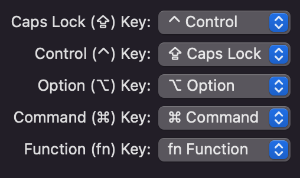

# 나의 개발환경 설정 (IDE, Keymap)

> 날짜: 2024-04-28

내가 선호하는 Mac 에서의 개발환경 세팅 기록

## Mac

### Settings

1. Accessibility - Display - Pointer : 포인트 사이즈 크게, 색상은 빨강 테두리 + 흰색 채우기
2. Keyboard - Text : 모든 입력 자동화 기능 OFF (자동 대문자, 자동 수정, 자동 띄어쓰기 등)
3. Keyboard - Keyboard - `Use F1, F2, etc. Keys as standard function keys` 체크

### Keymap

## PyCharm

### Settings

1. Plugins - eclipse keymap 설치
2. Show whitespaces - 하위 3개 전부 체크
3. 모든 Font: `Source Code Pro`, size: `15` 이상

### Keymap

Eclipse (macOS) copy

- Git Branches: `^B`
- Git Fetch: `^⌥\`
- Git Pull: `^⌥[`
- Git Push: `^⌥]`
- Replace in Files...: `^H`

# VisualStudio Code

- TBD ...

---

[목록으로](https://shiwoo-park.github.io/blog)
